# Design Document - Flowise Table Persistence

## Overview

Ce document décrit la conception d'un système de persistance pour les tables HTML générées dynamiquement par Flowise.js dans l'application Claraverse. Le système s'intègre avec l'architecture IndexedDB existante (`claraDatabaseService`) pour sauvegarder et restaurer automatiquement les tables générées par les requêtes n8n, en les liant aux sessions de chat Clara.

### Problème Actuel

Flowise.js (V17.1) génère des tables HTML dynamiques en interrogeant un endpoint n8n, mais ces tables disparaissent après actualisation de la page car elles ne sont pas persistées dans IndexedDB.

### Solution Proposée

Créer un nouveau store IndexedDB `clara_generated_tables` qui s'intègre avec les stores existants (`clara_sessions`, `clara_messages`, `clara_files`) pour persister les tables générées avec un système de fingerprint basé sur le contenu complet.

## Architecture

### Architecture Existante

```
┌─────────────────────────────────────────────────────────────┐
│                    Claraverse Application                    │
├─────────────────────────────────────────────────────────────┤
│  claraChatService.ts  │  claraDatabase.ts  │  indexedDB.ts  │
├─────────────────────────────────────────────────────────────┤
│                        IndexedDB                             │
│  ┌──────────────┐  ┌──────────────┐  ┌──────────────┐     │
│  │clara_sessions│  │clara_messages│  │ clara_files  │     │
│  └──────────────┘  └──────────────┘  └──────────────┘     │
└─────────────────────────────────────────────────────────────┘
```

### Architecture Proposée

```
┌───────────────────────────────────────────────────────────────────────┐
│                      Claraverse Application                            │
├───────────────────────────────────────────────────────────────────────┤
│  Flowise.js  │  flowiseTableService.ts  │  claraDatabaseService.ts   │
├───────────────────────────────────────────────────────────────────────┤
│                            IndexedDB                                   │
│  ┌──────────────┐  ┌──────────────┐  ┌──────────────┐  ┌──────────┐│
│  │clara_sessions│  │clara_messages│  │ clara_files  │  │clara_    ││
│  │              │  │              │  │              │  │generated_ ││
│  │              │  │              │  │              │  │tables     ││
│  └──────────────┘  └──────────────┘  └──────────────┘  └──────────┘│
└───────────────────────────────────────────────────────────────────────┘
```

## Components and Interfaces

### 1. FlowiseTableService (Nouveau)

Service TypeScript qui gère la persistance des tables générées par Flowise.js.

**Fichier:** `src/services/flowiseTableService.ts`


```typescript
export interface FlowiseGeneratedTable {
  id: string;                    // UUID unique
  sessionId: string;             // Référence à clara_sessions
  messageId?: string;            // Référence optionnelle à clara_messages
  keyword: string;               // Dynamic_Keyword extrait de la table Flowise
  html: string;                  // HTML complet de la table
  fingerprint: string;           // Hash du contenu complet
  containerId: string;           // ID du conteneur DIV parent
  position: number;              // Position dans le conteneur
  timestamp: string;             // ISO timestamp de création
  source: 'n8n' | 'cached' | 'error'; // Source de la table
  metadata: {
    rowCount: number;
    colCount: number;
    headers: string[];
    compressed: boolean;
    originalSize?: number;
  };
  user_id?: string;              // Pour isolation des données
}

export class FlowiseTableService {
  private readonly TABLES_STORE = 'clara_generated_tables';
  
  /**
   * Sauvegarder une table générée
   */
  async saveGeneratedTable(
    sessionId: string,
    tableElement: HTMLTableElement,
    keyword: string,
    source: 'n8n' | 'cached' | 'error',
    messageId?: string
  ): Promise<string>;
  
  /**
   * Restaurer toutes les tables d'une session
   */
  async restoreSessionTables(sessionId: string): Promise<FlowiseGeneratedTable[]>;
  
  /**
   * Générer un fingerprint basé sur le contenu complet
   */
  generateTableFingerprint(tableElement: HTMLTableElement): string;
  
  /**
   * Vérifier si une table existe déjà (éviter doublons)
   */
  async tableExists(sessionId: string, fingerprint: string): Promise<boolean>;
  
  /**
   * Supprimer toutes les tables d'une session
   */
  async deleteSessionTables(sessionId: string): Promise<void>;
  
  /**
   * Compresser le HTML si nécessaire
   */
  compressHTML(html: string): string;
  
  /**
   * Décompresser le HTML
   */
  decompressHTML(compressed: string): string;
}
```

### 2. Flowise.js Integration (Modifications)

Modifications à apporter au script Flowise.js existant pour émettre des événements.

**Fichier:** `Flowise.js` (modifications)

```javascript
// Après intégration d'une table dans le DOM
function integrateTablesOnly(n8nTables, targetContainer, targetKeyword) {
  // ... code existant ...
  
  // NOUVEAU: Émettre un événement pour chaque table intégrée
  n8nTables.forEach((table, index) => {
    const event = new CustomEvent('flowise:table:integrated', {
      detail: {
        table: table,
        keyword: targetKeyword,
        container: targetContainer,
        position: index,
        source: 'n8n',
        timestamp: Date.now()
      },
      bubbles: true
    });
    document.dispatchEvent(event);
  });
}

// Gestion des erreurs n8n
function handleN8nError(error, targetContainer, targetKeyword) {
  // ... code existant de création du message d'erreur ...
  
  // NOUVEAU: Émettre un événement pour l'erreur
  const event = new CustomEvent('flowise:table:integrated', {
    detail: {
      table: errorMessage,
      keyword: targetKeyword,
      container: targetContainer,
      position: 0,
      source: 'error',
      error: error.message,
      timestamp: Date.now()
    },
    bubbles: true
  });
  document.dispatchEvent(event);
}
```


### 3. FlowiseTableBridge (Nouveau)

Pont JavaScript qui écoute les événements Flowise et appelle le service TypeScript.

**Fichier:** `src/services/flowiseTableBridge.ts`

```typescript
export class FlowiseTableBridge {
  private flowiseTableService: FlowiseTableService;
  private currentSessionId: string | null = null;
  
  constructor() {
    this.flowiseTableService = new FlowiseTableService();
    this.initializeEventListeners();
    this.detectCurrentSession();
  }
  
  /**
   * Initialiser les écouteurs d'événements
   */
  private initializeEventListeners(): void {
    // Écouter les tables intégrées par Flowise
    document.addEventListener('flowise:table:integrated', (event: CustomEvent) => {
      this.handleTableIntegrated(event.detail);
    });
    
    // Écouter les changements de session
    document.addEventListener('claraverse:session:changed', (event: CustomEvent) => {
      this.currentSessionId = event.detail.sessionId;
      this.restoreTablesForSession(this.currentSessionId);
    });
  }
  
  /**
   * Gérer l'intégration d'une table
   */
  private async handleTableIntegrated(detail: any): Promise<void> {
    if (!this.currentSessionId) {
      console.warn('⚠️ Aucune session active, table non sauvegardée');
      return;
    }
    
    try {
      const tableElement = detail.table;
      const keyword = detail.keyword;
      const source = detail.source;
      
      // Générer le fingerprint
      const fingerprint = this.flowiseTableService.generateTableFingerprint(tableElement);
      
      // Vérifier si la table existe déjà
      const exists = await this.flowiseTableService.tableExists(
        this.currentSessionId,
        fingerprint
      );
      
      if (exists) {
        console.log('ℹ️ Table déjà sauvegardée, doublon ignoré');
        return;
      }
      
      // Sauvegarder la table
      const tableId = await this.flowiseTableService.saveGeneratedTable(
        this.currentSessionId,
        tableElement,
        keyword,
        source
      );
      
      console.log(`✅ Table sauvegardée: ${tableId}`);
      
      // Émettre un événement de confirmation
      const savedEvent = new CustomEvent('storage:table:saved', {
        detail: { tableId, sessionId: this.currentSessionId, keyword },
        bubbles: true
      });
      document.dispatchEvent(savedEvent);
      
    } catch (error) {
      console.error('❌ Erreur sauvegarde table:', error);
      
      // Émettre un événement d'erreur
      const errorEvent = new CustomEvent('storage:table:error', {
        detail: { error: error.message, sessionId: this.currentSessionId },
        bubbles: true
      });
      document.dispatchEvent(errorEvent);
      
      // Retry après 2 secondes
      setTimeout(() => this.handleTableIntegrated(detail), 2000);
    }
  }
  
  /**
   * Restaurer les tables pour une session
   */
  private async restoreTablesForSession(sessionId: string): Promise<void> {
    try {
      const tables = await this.flowiseTableService.restoreSessionTables(sessionId);
      
      for (const tableData of tables) {
        this.injectTableIntoDOM(tableData);
      }
      
      console.log(`✅ ${tables.length} table(s) restaurée(s) pour session ${sessionId}`);
    } catch (error) {
      console.error('❌ Erreur restauration tables:', error);
    }
  }
  
  /**
   * Injecter une table dans le DOM
   */
  private injectTableIntoDOM(tableData: FlowiseGeneratedTable): void {
    // Trouver ou créer le conteneur
    let container = document.querySelector(`[data-container-id="${tableData.containerId}"]`);
    
    if (!container) {
      // Créer un nouveau conteneur si nécessaire
      container = this.createTableContainer(tableData.containerId);
    }
    
    // Créer le wrapper de table
    const tableWrapper = document.createElement('div');
    tableWrapper.className = 'overflow-x-auto my-4';
    tableWrapper.setAttribute('data-n8n-table', 'true');
    tableWrapper.setAttribute('data-n8n-keyword', tableData.keyword);
    tableWrapper.setAttribute('data-table-id', tableData.id);
    tableWrapper.setAttribute('data-restored', 'true');
    
    // Insérer le HTML de la table
    tableWrapper.innerHTML = tableData.html;
    
    // Ajouter au conteneur
    container.appendChild(tableWrapper);
  }
  
  /**
   * Créer un conteneur de table
   */
  private createTableContainer(containerId: string): HTMLElement {
    const container = document.createElement('div');
    container.className = 'prose prose-base dark:prose-invert max-w-none';
    container.setAttribute('data-container-id', containerId);
    container.setAttribute('data-restored-container', 'true');
    
    // Trouver le point d'insertion approprié dans le chat
    const chatContainer = document.querySelector('.chat-messages-container') ||
                         document.querySelector('[data-chat-container]') ||
                         document.body;
    
    chatContainer.appendChild(container);
    return container;
  }
  
  /**
   * Détecter la session active
   */
  private detectCurrentSession(): void {
    // Méthode 1: Depuis l'état React global
    if (window.claraverseState?.currentSession?.id) {
      this.currentSessionId = window.claraverseState.currentSession.id;
      return;
    }
    
    // Méthode 2: Depuis l'URL
    const urlParams = new URLSearchParams(window.location.search);
    const sessionId = urlParams.get('sessionId') || urlParams.get('session');
    if (sessionId) {
      this.currentSessionId = sessionId;
      return;
    }
    
    // Méthode 3: Depuis le DOM
    const sessionElement = document.querySelector('[data-session-id]');
    if (sessionElement) {
      this.currentSessionId = sessionElement.getAttribute('data-session-id');
      return;
    }
    
    console.warn('⚠️ Impossible de détecter la session active');
  }
}

// Initialiser le bridge au chargement
if (document.readyState === 'loading') {
  document.addEventListener('DOMContentLoaded', () => {
    new FlowiseTableBridge();
  });
} else {
  new FlowiseTableBridge();
}
```


## Data Models

### FlowiseGeneratedTable (IndexedDB Record)

```typescript
interface FlowiseGeneratedTableRecord {
  id: string;                    // Primary key (UUID)
  sessionId: string;             // Index: Foreign key to clara_sessions
  messageId?: string;            // Index: Optional foreign key to clara_messages
  keyword: string;               // Index: Dynamic keyword for filtering
  html: string;                  // Compressed or raw HTML
  fingerprint: string;           // Index: Content-based hash
  containerId: string;           // Container DIV identifier
  position: number;              // Position in container
  timestamp: string;             // ISO string
  source: 'n8n' | 'cached' | 'error';
  metadata: {
    rowCount: number;
    colCount: number;
    headers: string[];           // Array of column headers
    compressed: boolean;
    originalSize?: number;       // Size before compression
  };
  user_id?: string;              // Index: For data isolation
}
```

### IndexedDB Schema Extension

```typescript
// Extension du schéma existant dans src/services/indexedDB.ts
const DB_SCHEMA = {
  // ... stores existants ...
  
  clara_generated_tables: {
    keyPath: 'id',
    indexes: [
      { name: 'sessionId', keyPath: 'sessionId', unique: false },
      { name: 'messageId', keyPath: 'messageId', unique: false },
      { name: 'keyword', keyPath: 'keyword', unique: false },
      { name: 'fingerprint', keyPath: 'fingerprint', unique: false },
      { name: 'user_id', keyPath: 'user_id', unique: false },
      { name: 'timestamp', keyPath: 'timestamp', unique: false },
      { name: 'sessionId_fingerprint', keyPath: ['sessionId', 'fingerprint'], unique: true }
    ]
  }
};
```

### Fingerprint Algorithm

Le fingerprint est calculé à partir du contenu complet de la table :

```typescript
function generateTableFingerprint(table: HTMLTableElement): string {
  const data = {
    headers: extractHeaders(table),
    rows: extractAllRows(table),
    structure: {
      rowCount: table.querySelectorAll('tr').length,
      colCount: table.querySelector('tr')?.children.length || 0
    }
  };
  
  // Créer une signature unique
  const signature = JSON.stringify(data);
  
  // Calculer un hash SHA-256
  return sha256(signature);
}

function extractHeaders(table: HTMLTableElement): string[] {
  const headerRow = table.querySelector('thead tr') || table.querySelector('tr');
  if (!headerRow) return [];
  
  return Array.from(headerRow.querySelectorAll('th, td'))
    .map(cell => cell.textContent?.trim() || '');
}

function extractAllRows(table: HTMLTableElement): string[][] {
  const rows = table.querySelectorAll('tbody tr, tr');
  return Array.from(rows).map(row => 
    Array.from(row.querySelectorAll('td, th'))
      .map(cell => cell.textContent?.trim() || '')
  );
}
```

## Error Handling

### 1. Session Detection Failure

```typescript
class SessionDetectionError extends Error {
  constructor(message: string) {
    super(message);
    this.name = 'SessionDetectionError';
  }
}

// Stratégie de fallback
async function detectSessionWithFallback(): Promise<string> {
  const methods = [
    detectFromReactState,
    detectFromURL,
    detectFromDOM,
    createTemporarySession
  ];
  
  for (const method of methods) {
    try {
      const sessionId = await method();
      if (sessionId) return sessionId;
    } catch (error) {
      console.warn(`Method failed: ${method.name}`, error);
    }
  }
  
  throw new SessionDetectionError('All detection methods failed');
}
```

### 2. Storage Quota Exceeded

```typescript
async function handleQuotaExceeded(error: DOMException): Promise<void> {
  if (error.name === 'QuotaExceededError') {
    console.warn('⚠️ Quota de stockage dépassé, nettoyage en cours...');
    
    // Nettoyer les tables les plus anciennes
    await cleanupOldTables();
    
    // Retry l'opération
    return;
  }
  
  throw error;
}

async function cleanupOldTables(): Promise<void> {
  const tables = await getAllTables();
  
  // Trier par timestamp (plus anciennes en premier)
  tables.sort((a, b) => 
    new Date(a.timestamp).getTime() - new Date(b.timestamp).getTime()
  );
  
  // Supprimer les 20% les plus anciennes
  const toDelete = Math.ceil(tables.length * 0.2);
  for (let i = 0; i < toDelete; i++) {
    await deleteTable(tables[i].id);
  }
  
  console.log(`🧹 ${toDelete} tables supprimées`);
}
```

### 3. Duplicate Table Detection

```typescript
async function saveTableWithDuplicateCheck(
  sessionId: string,
  table: HTMLTableElement,
  keyword: string
): Promise<string | null> {
  const fingerprint = generateTableFingerprint(table);
  
  // Vérifier si une table avec le même fingerprint existe
  const existing = await findTableByFingerprint(sessionId, fingerprint);
  
  if (existing) {
    console.log('ℹ️ Table identique déjà sauvegardée, doublon ignoré');
    return null;
  }
  
  // Sauvegarder la nouvelle table
  return await saveTable(sessionId, table, keyword, fingerprint);
}
```


## Testing Strategy

### 1. Unit Tests

```typescript
// Test de génération de fingerprint
describe('FlowiseTableService - Fingerprint Generation', () => {
  test('should generate same fingerprint for identical tables', () => {
    const table1 = createMockTable(sameData);
    const table2 = createMockTable(sameData);
    
    const fp1 = service.generateTableFingerprint(table1);
    const fp2 = service.generateTableFingerprint(table2);
    
    expect(fp1).toBe(fp2);
  });
  
  test('should generate different fingerprints for different content', () => {
    const table1 = createMockTable(data1);
    const table2 = createMockTable(data2);
    
    const fp1 = service.generateTableFingerprint(table1);
    const fp2 = service.generateTableFingerprint(table2);
    
    expect(fp1).not.toBe(fp2);
  });
  
  test('should generate different fingerprints for same keyword but different data', () => {
    const table1 = createTableWithKeyword('Flowise', data1);
    const table2 = createTableWithKeyword('Flowise', data2);
    
    const fp1 = service.generateTableFingerprint(table1);
    const fp2 = service.generateTableFingerprint(table2);
    
    expect(fp1).not.toBe(fp2);
  });
});

// Test de sauvegarde et restauration
describe('FlowiseTableService - Save and Restore', () => {
  test('should save and restore table correctly', async () => {
    const table = createMockTable();
    const sessionId = 'test-session-123';
    
    const tableId = await service.saveGeneratedTable(
      sessionId,
      table,
      'TestKeyword',
      'n8n'
    );
    
    expect(tableId).toBeTruthy();
    
    const restored = await service.restoreSessionTables(sessionId);
    expect(restored).toHaveLength(1);
    expect(restored[0].keyword).toBe('TestKeyword');
  });
  
  test('should not save duplicate tables', async () => {
    const table = createMockTable();
    const sessionId = 'test-session-123';
    
    await service.saveGeneratedTable(sessionId, table, 'Keyword', 'n8n');
    
    const exists = await service.tableExists(
      sessionId,
      service.generateTableFingerprint(table)
    );
    
    expect(exists).toBe(true);
  });
});
```

### 2. Integration Tests

```typescript
describe('Flowise Integration - End to End', () => {
  test('should capture Flowise event and save table', async () => {
    const mockTable = createMockTable();
    const sessionId = 'integration-test-session';
    
    // Simuler l'événement Flowise
    const event = new CustomEvent('flowise:table:integrated', {
      detail: {
        table: mockTable,
        keyword: 'TestKeyword',
        source: 'n8n',
        timestamp: Date.now()
      }
    });
    
    document.dispatchEvent(event);
    
    // Attendre la sauvegarde
    await waitFor(() => {
      return service.tableExists(sessionId, fingerprint);
    });
    
    const tables = await service.restoreSessionTables(sessionId);
    expect(tables).toHaveLength(1);
  });
  
  test('should restore tables on session change', async () => {
    // Préparer des tables sauvegardées
    const sessionId = 'test-session-456';
    await service.saveGeneratedTable(sessionId, table1, 'Keyword1', 'n8n');
    await service.saveGeneratedTable(sessionId, table2, 'Keyword2', 'n8n');
    
    // Simuler un changement de session
    const event = new CustomEvent('claraverse:session:changed', {
      detail: { sessionId }
    });
    
    document.dispatchEvent(event);
    
    // Vérifier que les tables sont restaurées dans le DOM
    await waitFor(() => {
      const restoredTables = document.querySelectorAll('[data-restored="true"]');
      return restoredTables.length === 2;
    });
  });
});
```

### 3. Performance Tests

```typescript
describe('Performance Tests', () => {
  test('should handle 100 tables without performance degradation', async () => {
    const sessionId = 'perf-test-session';
    const startTime = performance.now();
    
    // Sauvegarder 100 tables
    for (let i = 0; i < 100; i++) {
      const table = createMockTable({ id: i });
      await service.saveGeneratedTable(sessionId, table, `Keyword${i}`, 'n8n');
    }
    
    const saveTime = performance.now() - startTime;
    expect(saveTime).toBeLessThan(5000); // < 5 secondes
    
    // Restaurer toutes les tables
    const restoreStart = performance.now();
    const tables = await service.restoreSessionTables(sessionId);
    const restoreTime = performance.now() - restoreStart;
    
    expect(tables).toHaveLength(100);
    expect(restoreTime).toBeLessThan(2000); // < 2 secondes
  });
  
  test('should compress large tables efficiently', () => {
    const largeTable = createLargeTable(1000); // 1000 lignes
    const html = largeTable.outerHTML;
    
    expect(html.length).toBeGreaterThan(50000); // > 50KB
    
    const compressed = service.compressHTML(html);
    const compressionRatio = compressed.length / html.length;
    
    expect(compressionRatio).toBeLessThan(0.5); // Au moins 50% de compression
    
    const decompressed = service.decompressHTML(compressed);
    expect(decompressed).toBe(html);
  });
});
```

## Implementation Phases

### Phase 1: Core Infrastructure (Semaine 1)
- Créer `flowiseTableService.ts` avec les méthodes de base
- Étendre le schéma IndexedDB avec `clara_generated_tables`
- Implémenter l'algorithme de fingerprint
- Tests unitaires du service

### Phase 2: Event Integration (Semaine 2)
- Créer `flowiseTableBridge.ts`
- Modifier `Flowise.js` pour émettre les événements
- Implémenter la détection de session
- Tests d'intégration des événements

### Phase 3: Restoration System (Semaine 3)
- Implémenter la restauration des tables au chargement
- Gérer la création de conteneurs manquants
- Implémenter la gestion des doublons
- Tests de restauration

### Phase 4: Optimization & Cleanup (Semaine 4)
- Implémenter la compression HTML
- Ajouter le nettoyage automatique
- Optimiser les performances
- Tests de performance et stress

### Phase 5: Integration with Clara Chat (Semaine 5)
- Lier les tables aux messages Clara
- Implémenter la suppression en cascade
- Ajouter les outils de diagnostic
- Tests end-to-end complets


## Sequence Diagrams

### Sauvegarde d'une Table Générée

```mermaid
sequenceDiagram
    participant F as Flowise.js
    participant D as DOM
    participant B as FlowiseTableBridge
    participant S as FlowiseTableService
    participant IDB as IndexedDB

    F->>D: Intégrer table dans DOM
    F->>D: Émettre événement 'flowise:table:integrated'
    D->>B: Événement capturé
    B->>B: Détecter sessionId
    B->>S: generateTableFingerprint(table)
    S-->>B: fingerprint
    B->>S: tableExists(sessionId, fingerprint)
    S->>IDB: Requête par index
    IDB-->>S: false (pas de doublon)
    S-->>B: false
    B->>S: saveGeneratedTable(...)
    S->>S: Extraire métadonnées
    S->>S: Compresser si > 50KB
    S->>IDB: put(tableRecord)
    IDB-->>S: Success
    S-->>B: tableId
    B->>D: Émettre 'storage:table:saved'
```



### Restauration des Tables au Chargement

```mermaid
sequenceDiagram
    participant U as User
    participant A as App
    participant B as FlowiseTableBridge
    participant S as FlowiseTableService
    participant IDB as IndexedDB
    participant D as DOM

    U->>A: Ouvrir session de chat
    A->>D: Émettre 'claraverse:session:changed'
    D->>B: Événement capturé
    B->>B: Mettre à jour currentSessionId
    B->>S: restoreSessionTables(sessionId)
    S->>IDB: getAll avec index sessionId
    IDB-->>S: tableRecords[]
    S->>S: Décompresser HTML si nécessaire
    S-->>B: FlowiseGeneratedTable[]
    loop Pour chaque table
        B->>D: Trouver/créer conteneur
        B->>D: Injecter table dans DOM
        D->>D: Marquer data-restored="true"
    end
    B->>U: Tables restaurées
```



### Gestion des Doublons

```mermaid
sequenceDiagram
    participant F as Flowise.js
    participant B as FlowiseTableBridge
    participant S as FlowiseTableService
    participant IDB as IndexedDB

    F->>B: Nouvelle table (événement)
    B->>S: generateTableFingerprint(table)
    S-->>B: fingerprint
    B->>S: tableExists(sessionId, fingerprint)
    S->>IDB: get par index composite
    IDB-->>S: tableRecord (existe)
    S-->>B: true
    B->>B: Ignorer sauvegarde
    B->>Console: Log "Table déjà sauvegardée"
```



## Migration Strategy

Aucune migration n'est nécessaire car il s'agit d'un nouveau système. Cependant, voici la stratégie de déploiement :

### Déploiement Progressif

1. **Phase 1 - Infrastructure**
   - Déployer le nouveau store IndexedDB
   - Déployer `flowiseTableService.ts`
   - Aucun impact sur l'existant

2. **Phase 2 - Bridge**
   - Déployer `flowiseTableBridge.ts`
   - Activer l'écoute des événements
   - Mode passif (écoute mais ne restaure pas encore)

3. **Phase 3 - Flowise Integration**
   - Modifier `Flowise.js` pour émettre les événements
   - Activer la sauvegarde automatique
   - Tester en production avec monitoring

4. **Phase 4 - Restoration**
   - Activer la restauration automatique
   - Monitoring intensif des performances
   - Rollback possible si problèmes

### Rollback Plan

Si des problèmes surviennent :

1. Désactiver l'émission d'événements dans `Flowise.js`
2. Désactiver la restauration dans `flowiseTableBridge.ts`
3. Les données restent dans IndexedDB (pas de perte)
4. Analyser les logs et corriger
5. Redéployer avec corrections

## Monitoring and Diagnostics

### API de Diagnostic

```typescript
export class FlowiseTableDiagnostics {
  /**
   * Obtenir les statistiques de stockage
   */
  async getStorageStats(): Promise<{
    totalTables: number;
    tablesBySession: Map<string, number>;
    totalSize: number;
    averageSize: number;
    compressedTables: number;
    errorTables: number;
  }>;
  
  /**
   * Vérifier l'intégrité des données
   */
  async checkIntegrity(): Promise<{
    orphanedTables: number;
    corruptedTables: number;
    duplicates: number;
  }>;
  
  /**
   * Lister les tables d'une session
   */
  async listSessionTables(sessionId: string): Promise<{
    id: string;
    keyword: string;
    timestamp: string;
    size: number;
    source: string;
  }[]>;
  
  /**
   * Nettoyer les tables orphelines
   */
  async cleanupOrphanedTables(): Promise<number>;
}
```

### Logging Strategy

```typescript
// Niveaux de log
enum LogLevel {
  DEBUG = 'DEBUG',
  INFO = 'INFO',
  WARN = 'WARN',
  ERROR = 'ERROR'
}

// Logger centralisé
class FlowiseTableLogger {
  log(level: LogLevel, message: string, data?: any): void {
    const timestamp = new Date().toISOString();
    const logEntry = {
      timestamp,
      level,
      message,
      data,
      sessionId: this.currentSessionId
    };
    
    console.log(`[${level}] ${message}`, data);
    
    // Envoyer les erreurs à un service de monitoring
    if (level === LogLevel.ERROR) {
      this.sendToMonitoring(logEntry);
    }
  }
}
```

## Security Considerations

### 1. Data Isolation

Les tables sont isolées par `user_id` comme les autres données Clara :

```typescript
async saveGeneratedTable(...): Promise<string> {
  const currentUserId = await this.getCurrentUserId();
  if (!currentUserId) {
    throw new Error('No user logged in');
  }
  
  const tableRecord = {
    ...tableData,
    user_id: currentUserId
  };
  
  await indexedDBService.put(this.TABLES_STORE, tableRecord);
}
```

### 2. HTML Sanitization

Le HTML des tables doit être sanitizé avant sauvegarde :

```typescript
import DOMPurify from 'dompurify';

function sanitizeTableHTML(html: string): string {
  return DOMPurify.sanitize(html, {
    ALLOWED_TAGS: ['table', 'thead', 'tbody', 'tr', 'th', 'td', 'a'],
    ALLOWED_ATTR: ['class', 'href', 'target', 'rel', 'data-*']
  });
}
```

### 3. Storage Quota Management

Limiter la taille totale des tables par utilisateur :

```typescript
const MAX_TABLES_PER_USER = 500;
const MAX_STORAGE_SIZE = 50 * 1024 * 1024; // 50 MB

async function checkStorageLimits(userId: string): Promise<boolean> {
  const stats = await getStorageStats(userId);
  
  if (stats.totalTables >= MAX_TABLES_PER_USER) {
    await cleanupOldestTables(userId, 50); // Supprimer 50 tables
  }
  
  if (stats.totalSize >= MAX_STORAGE_SIZE) {
    await cleanupOldestTables(userId, 100); // Supprimer 100 tables
  }
  
  return true;
}
```

## Performance Optimizations

### 1. Lazy Loading

Ne charger les tables que lorsqu'elles sont visibles :

```typescript
const observer = new IntersectionObserver((entries) => {
  entries.forEach(entry => {
    if (entry.isIntersecting) {
      const tableId = entry.target.getAttribute('data-table-id');
      loadTableContent(tableId);
    }
  });
});
```

### 2. Batch Operations

Sauvegarder plusieurs tables en une seule transaction :

```typescript
async function saveTables Batch(tables: TableData[]): Promise<void> {
  const transaction = db.transaction([TABLES_STORE], 'readwrite');
  const store = transaction.objectStore(TABLES_STORE);
  
  for (const table of tables) {
    store.put(table);
  }
  
  await transaction.complete;
}
```

### 3. Caching

Mettre en cache les tables fréquemment accédées :

```typescript
class TableCache {
  private cache = new Map<string, FlowiseGeneratedTable>();
  private maxSize = 50;
  
  get(tableId: string): FlowiseGeneratedTable | null {
    return this.cache.get(tableId) || null;
  }
  
  set(tableId: string, table: FlowiseGeneratedTable): void {
    if (this.cache.size >= this.maxSize) {
      const firstKey = this.cache.keys().next().value;
      this.cache.delete(firstKey);
    }
    this.cache.set(tableId, table);
  }
}
```

